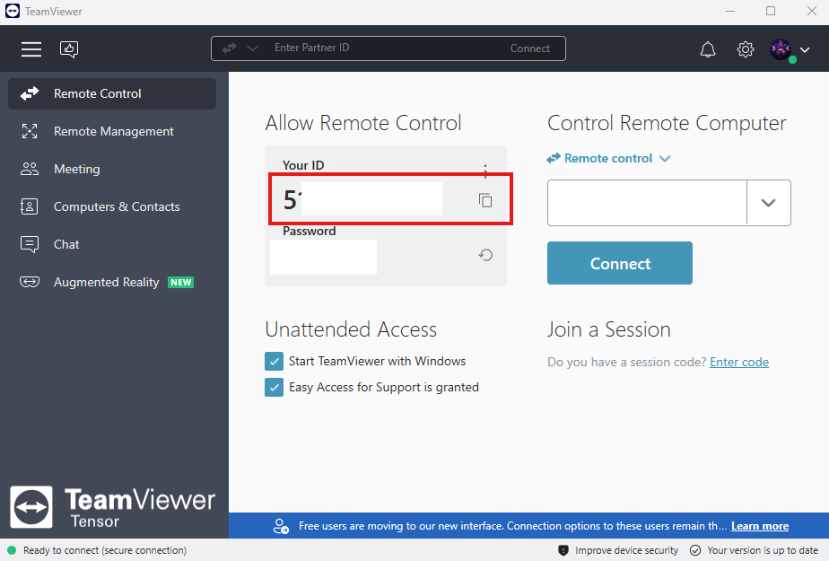

From our new Remote policy, users must provide Teamviewer ID before remote used to our remote computer.

> Install Teamviewer for Lastest version from : http://teamviewer.com.

> When installation is completed, open teamviewer program from your computer.

> Please copy <u>only</u> " Your ID " and e-mail to engineering team (as image attached)
  

